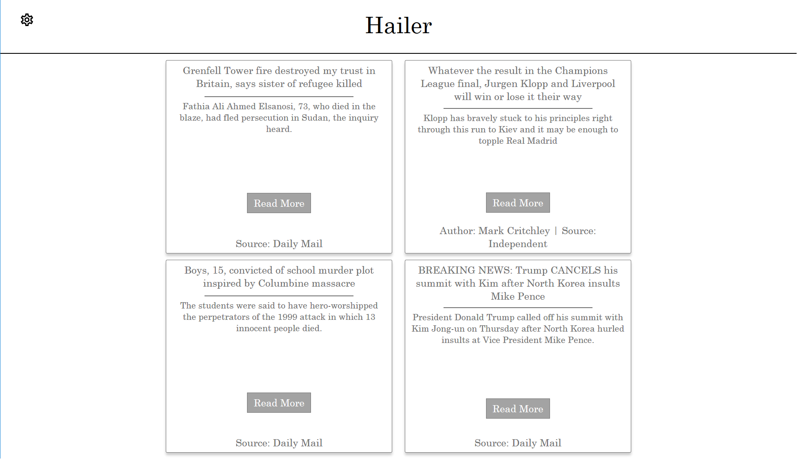
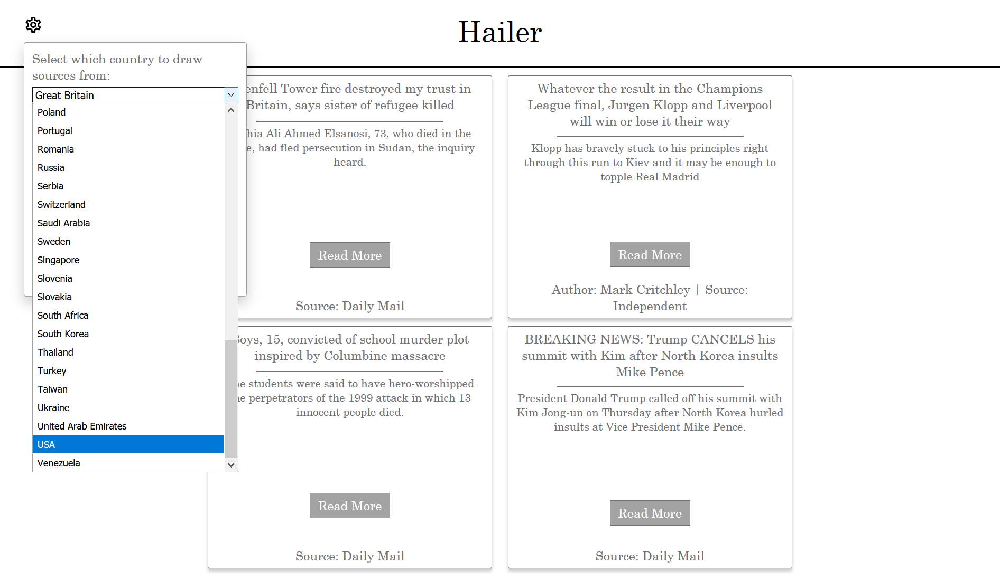
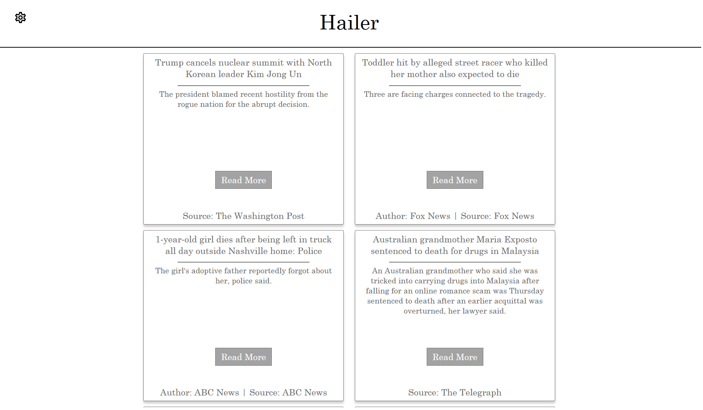

# Hailer

A mini-project to refresh my memory of web development skills, also used CSS Grid for the first time! The site draws news from NewsAPI.org and displays it on simple cards. The site is *slightly* reactive and makes use of a few very simple media queries - I need to learn more about building websites for both mobile and desktop in the coming months!

Some of the code seems to me a little "hacky", so in future once I know more I would like to go over it again and clean it up.

The UK's Top Headlines on 24/05/18

I wonder what is going on in the US today...

